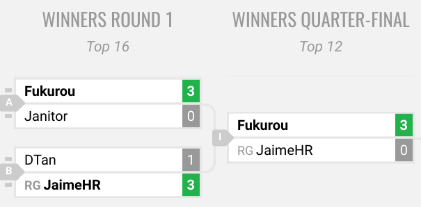

# Guidelines for recording info for Smash Archive

## Project overview

I want to archive info on every competitive game and organize it in a spreadsheet.
Ultimately I want to do this for all "competitive enough" tournaments, but I'm gonna start with just games in bracket at majors.

## The details

[This spreadsheet](https://docs.google.com/spreadsheets/d/1zpuTBg0k5njPZfxUNXf7VUhsi9F1QSBYcaeE1i7PKNE/edit#gid=1187659820) shows everything that's been done so far.

The sheet named "Overview" says which tournaments I have archived, and which others I want to archive. So far I have only written down info on games that were on video (marked "DONE" in the column labeled "Video")---this was because I could get character info for those games.
My next step is to get info from games not on camera, simply by reading from smashgg or challonge.com brackets.

Since the biggest motivation for this is to improve player rankings, I just want to start with the most competitive games at the most competitive tournaments --- so for now I'm going to archive just bracket games from majors.

## Example archive

Pick a tournament and open a fresh clean empty google-spreadsheet.
Look at the tournament bracket (the actual final bracket, not the bracket for a placement pool or waterfall D2/D3/D4 bracket) on smash.gg (or challonge).
You can find those all in the Smash Archive [overview spreadsheet](https://docs.google.com/spreadsheets/d/1zpuTBg0k5njPZfxUNXf7VUhsi9F1QSBYcaeE1i7PKNE/edit#gid=1187659820) (look at column H titled "bracket")

For each match in the bracket, record the relevant information in a single row of the spreadsheet.

Here's an example few matches. Figure 1 (below) shows three matches from the Snosa III bracket.

This table shows how to enter those matches in the archive spreadsheet:

| tourney year | tourney name | player1 | player2 | #-wins-player1 | #-wins-player2 | best of X | top Y |
|:---|:---|:---|:---|---:|---:|---:|---:|
| 2017 | snosa3 | fukurou | janitor | 3 | 0 | 5 | 16 |
| 2017 | snosa3 | dtan | jaimehr | 1 | 3 | 5 | 16 |
| 2017 | snosa3 | fukurou | jaimehr | 3 | 0 | 5 | 12 |

## How to handle playernames

Some players have names that are cumbersome to type (I'm look at you SuPErboOMFan).
So! I decided to make things easier for archiving and do away with anything I didn't like:

* all letters are lowercase
* omit all punctuation marks, including `.  ,  $  _` and anything else you see.
* using numbers is fine, e.g. `dext3r`.

Examples:

* `lord_narwhal` I enter as `lordnarwhal`
* `SuPeRbOoMfAn` I enter as `superboomfan`
* `free$` I enter as `free`
* `Q!` I enter as `q`

## How to submit to the Archive

Once you enter a tournament's entire bracket in one spreadsheet in the proper formatting,
send me a link to the spreadsheet so I can check it then enter it into the master spreadsheet.
Then bask in the good karma you've earned.
